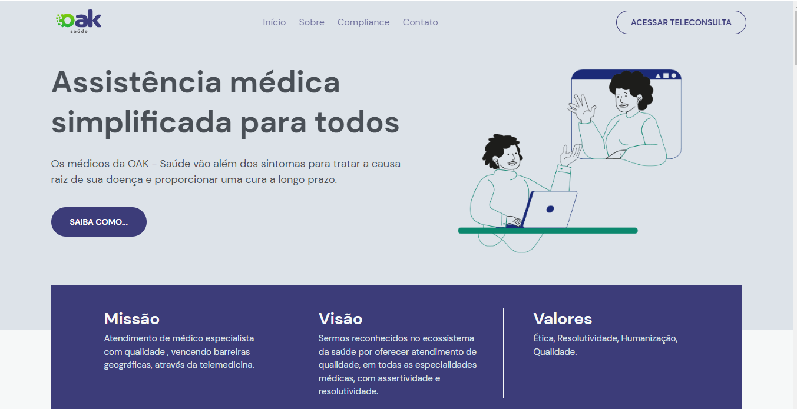
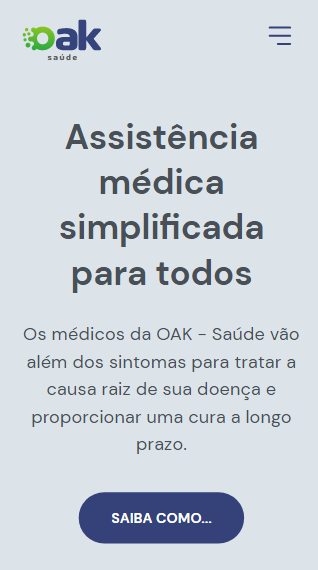

<h1 align="center"> OAK - Saúde </h1>

Esse projeto é a solução para uma boa comunicação entre os pacientes e médicos, criado para empresa OAK.

  <a href="#-tecnologias">Tecnologias</a>&nbsp;&nbsp;&nbsp;|&nbsp;&nbsp;&nbsp;
  <a href="#-projeto">Projeto</a>&nbsp;&nbsp;&nbsp;|&nbsp;&nbsp;&nbsp;
  <a href="#-layout">Layout</a>&nbsp;&nbsp;&nbsp;&nbsp;&nbsp;&nbsp;

 

<h2 align="center"> Versão Web  </h2>

 

<h2 align="center"> Versão Mobile </h2>

  

 

## 🚀 Tecnologias

Esse projeto foi desenvolvido com as seguintes tecnologias:

&nbsp;
&nbsp;
&nbsp;